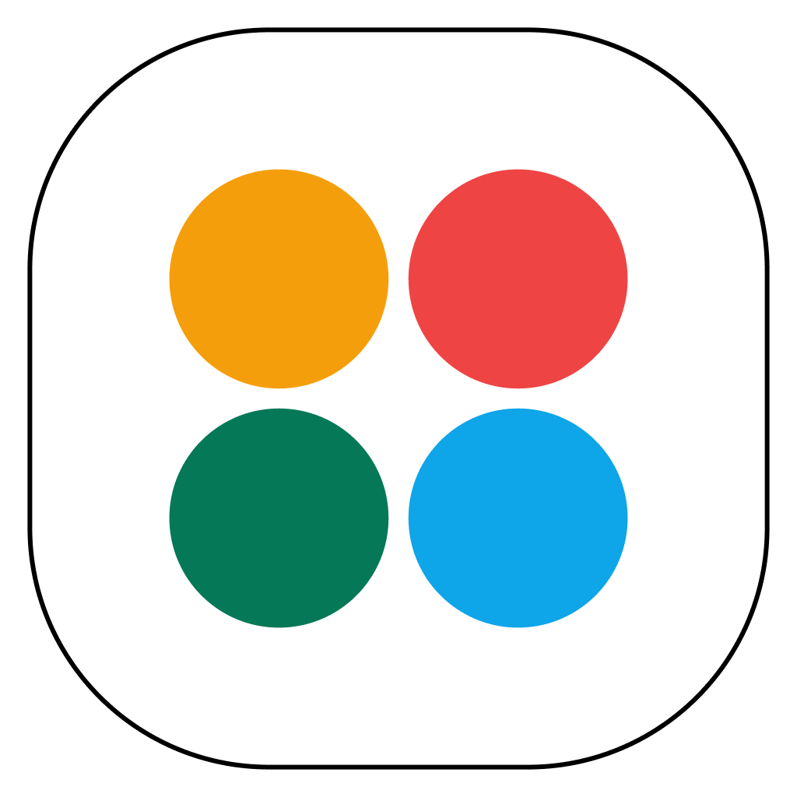
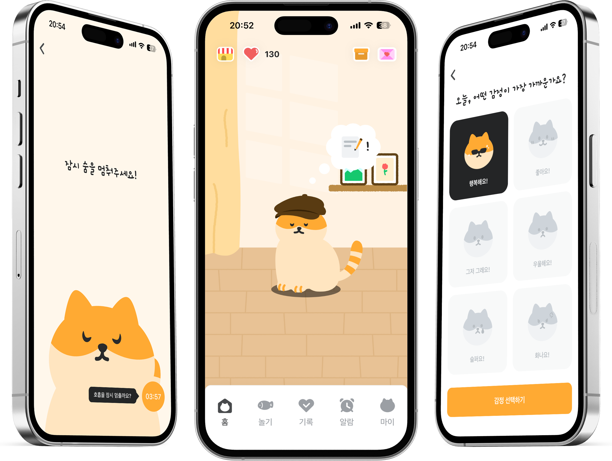

# 👋 Hi, I'm Jisung Chun!
🚀 Web Fullstack / MES C# Developer

🎓 성결대학교 컴퓨터공학과 졸업
💡 관심분야: 스프링 백엔드, 웹/모바일 프론트엔드, AI 개발

## 💻 Projects
| &nbsp;&nbsp;[SKURI (2025~2026)](https://github.com/skuri-kr) | &nbsp;&nbsp;[우리동네 국회의원 (2026)](https://github.com/jisung-louis/ourassembly) | &nbsp;&nbsp;[숨숨 (2025)](https://github.com/jisung-louis/soomsoom) |
| --- | --- | --- |
|  |  |  |
| 성결대 실시간 공지사항, 택시동승, 정보제공 통합 플랫폼 앱 | 국회의원 정보확인 및 소통 플랫폼 | 마음운동/감정기록 앱 |
|      |      |    |
| [ 스쿠리 프론트엔드 레포](https://github.com/skuri-kr/SKURI-Frontend) [ 스쿠리 백엔드 레포](https://github.com/skuri-kr/SKURI-Backend) | [ 우리동네국회의원 레포](https://github.com/jisung-louis/ourassembly) (FE/BE 모노레포) | [ 숨숨 프론트엔드 레포](https://github.com/jisung-louis/soomsoom) |
| [<image src="https://cdn.jsdelivr.net/npm/simple-icons@v16/icons/appstore.svg" width="20">  스쿠리 앱스토어](https://apps.apple.com/kr/app/스쿠리-skuri/id6754636203) [<image src="https://cdn.jsdelivr.net/npm/simple-icons@v16/icons/googleplay.svg" width="20">  스쿠리 플레이스토어](https://play.google.com/store/apps/details?id=com.jisung.sktaxi) |  | [<image src="https://cdn.jsdelivr.net/npm/simple-icons@v16/icons/appstore.svg" width="20">  숨숨 앱스토어](https://apps.apple.com/kr/app/숨숨/id6752624555) [<image src="https://cdn.jsdelivr.net/npm/simple-icons@v16/icons/googleplay.svg" width="20">  숨숨 플레이스토어](https://play.google.com/store/apps/details?id=com.soomsoom.app)|

## 🛠️ Tech Stack

### Backend

  
  
  
  
  

### Frontend / Mobile

  
  
  
  

### Infra / Tools

  
  
  
  
  

## 🌱 Currently learning
AI Embedding, RAG, ChatBot, AI Based Dev Workflow, Harness Engineering, Machine Learning, Deep Learning

## 📫 Contact
✉️ [khkh9357@naver.com]
